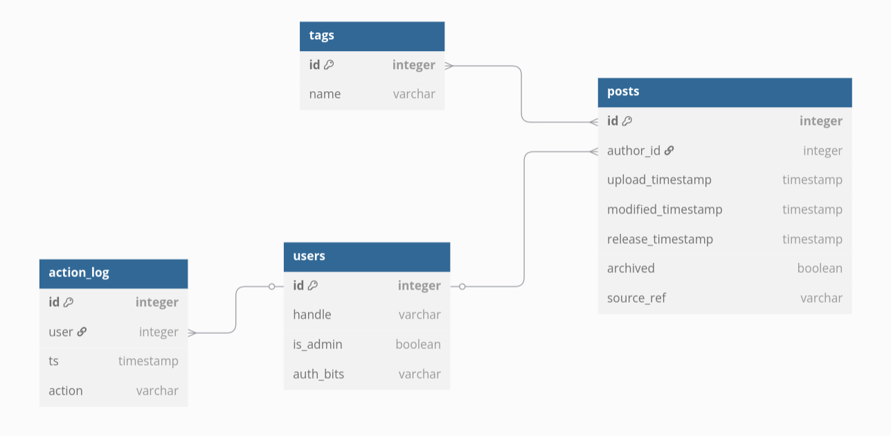

# Backend CMS

Серверная часть приложения CMS. Схему бд можно увидеть в `./database.dbml` или
ниже

## Документация

База данных состоит из docker-контейнеров, управляемых с помощью
`docker-compose` (см. файл `./docker-compose.yaml`).
1. Контейнер `database` открывает postgresql-сервер на порте 8000 в сети
`database-network`. Пароль для пользователя `postgres` должен лежать в
переменной `POSTGRES_PASSWORD` в файле `.env`. Также перед запуском должна быть
создана папка `./db-data`, она используется для сохранения данных между
запусками контейнера. Если папка `./db-data` пуста, запускатеся скрипт
`./db-init/init.sql`, создающий базу данных и отношения.
2. *Контейнер http-сервер*

